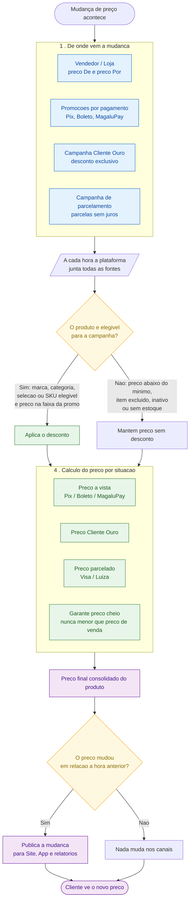

```mermaid
flowchart TD
    START([Mudança de preço acontece])

    subgraph ORIGENS[1 . De onde vem a mudanca]
        L[Vendedor / Loja<br/>preco De e preco Por]
        P[Promocoes por pagamento<br/>Pix, Boleto, MagaluPay]
        O[Campanha Cliente Ouro<br/>desconto exclusivo]
        PARC[Campanha de parcelamento<br/>parcelas sem juros]
    end

    START --> ORIGENS

    HORA[/A cada hora a plataforma<br/>junta todas as fontes/]
    ORIGENS --> HORA

    ELEG{O produto e elegivel<br/>para a campanha?}
    HORA --> ELEG

    ELEG -->|Sim: marca, categoria,<br/>selecao ou SKU elegivel<br/>e preco na faixa da promo| APLICA[Aplica o desconto]
    ELEG -->|Nao: preco abaixo do minimo,<br/>item excluido, inativo<br/>ou sem estoque| SEMDESC[Mantem preco sem desconto]

    subgraph CALC[4 . Calculo do preco por situacao]
        C1[Preco a vista<br/>Pix / Boleto / MagaluPay]
        C2[Preco Cliente Ouro]
        C3[Preco parcelado<br/>Visa / Luiza]
        C4[Garante preco cheio<br/>nunca menor que preco de venda]
    end

    APLICA --> CALC
    SEMDESC --> CALC

    FINAL[Preco final consolidado do produto]
    CALC --> FINAL

    MUDOU{O preco mudou<br/>em relacao a hora anterior?}
    FINAL --> MUDOU

    MUDOU -->|Sim| AVISA[Publica a mudanca<br/>para Site, App e relatorios]
    MUDOU -->|Nao| NADA[Nada muda nos canais]

    AVISA --> FIM([Cliente ve o novo preco])
    NADA --> FIM

    classDef origem fill:#E3F2FD,stroke:#1565C0,color:#0D47A1;
    classDef decisao fill:#FFF8E1,stroke:#F9A825,color:#8D6E00;
    classDef calc fill:#E8F5E9,stroke:#2E7D32,color:#1B5E20;
    classDef fim fill:#F3E5F5,stroke:#6A1B9A,color:#4A148C;

    class L,P,O,PARC origem;
    class ELEG,MUDOU decisao;
    class C1,C2,C3,C4,APLICA calc;
    class FINAL,AVISA,FIM fim;
```