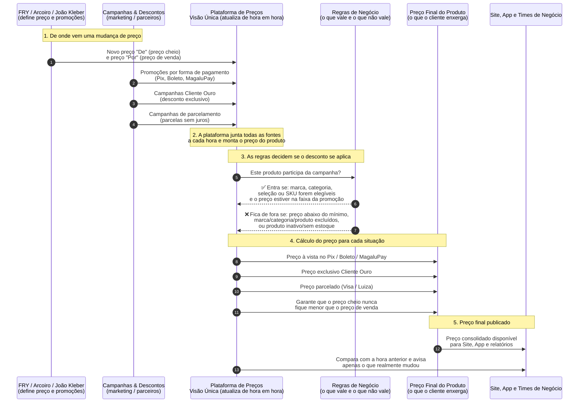

```mermaid
sequenceDiagram
    autonumber
    participant LOJA as FRY / Arcoiro / João Kleber<br/>(define preço e promoções)
    participant CAMP as Campanhas & Descontos<br/>(marketing / parceiros)
    participant SIS as Plataforma de Preços<br/>Visão Única (atualiza de hora em hora)
    participant REGRAS as Regras de Negócio<br/>(o que vale e o que não vale)
    participant PRECO as Preço Final do Produto<br/>(o que o cliente enxerga)
    participant CANAIS as Site, App e Times de Negócio

    Note over LOJA,CAMP: 1. De onde vem uma mudança de preço
    LOJA->>SIS: Novo preço "De" (preço cheio)<br/>e preço "Por" (preço de venda)
    CAMP->>SIS: Promoções por forma de pagamento<br/>(Pix, Boleto, MagaluPay)
    CAMP->>SIS: Campanhas Cliente Ouro<br/>(desconto exclusivo)
    CAMP->>SIS: Campanhas de parcelamento<br/>(parcelas sem juros)

    Note over SIS: 2. A plataforma junta todas as fontes<br/>a cada hora e monta o preço do produto

    Note over SIS,REGRAS: 3. As regras decidem se o desconto se aplica
    SIS->>REGRAS: Este produto participa da campanha?
    REGRAS-->>SIS: ✅ Entra se: marca, categoria,<br/>seleção ou SKU forem elegíveis<br/>e o preço estiver na faixa da promoção
    REGRAS-->>SIS: ❌ Fica de fora se: preço abaixo do mínimo,<br/>marca/categoria/produto excluídos,<br/>ou produto inativo/sem estoque

    Note over SIS,PRECO: 4. Cálculo do preço para cada situação
    SIS->>PRECO: Preço à vista no Pix / Boleto / MagaluPay
    SIS->>PRECO: Preço exclusivo Cliente Ouro
    SIS->>PRECO: Preço parcelado (Visa / Luiza)
    SIS->>PRECO: Garante que o preço cheio nunca<br/>fique menor que o preço de venda

    Note over PRECO,CANAIS: 5. Preço final publicado
    PRECO->>CANAIS: Preço consolidado disponível<br/>para Site, App e relatórios
    SIS->>CANAIS: Compara com a hora anterior e avisa<br/>apenas o que realmente mudou
```    