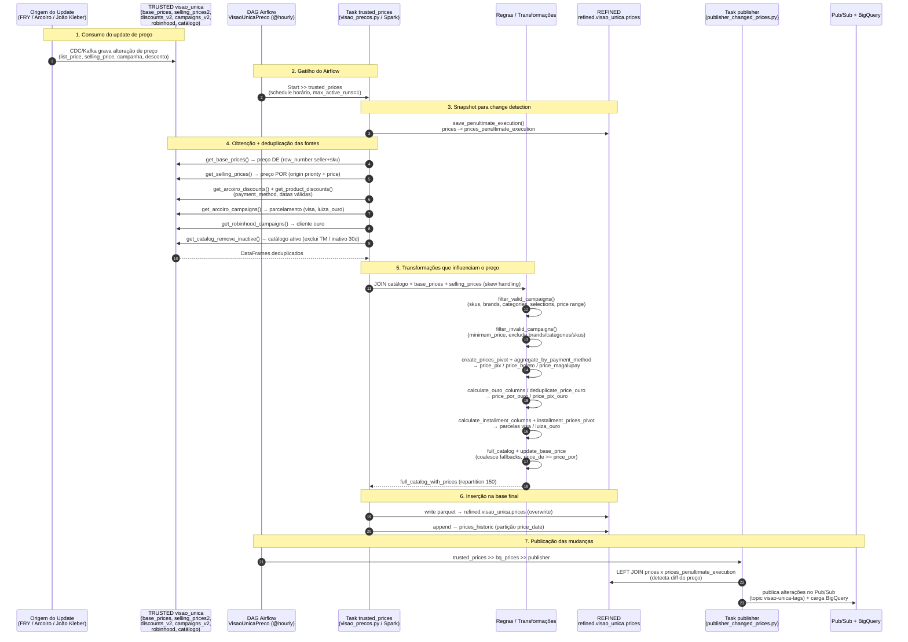

```mermaid
sequenceDiagram
    autonumber
    participant SRC as Origem do Update<br/>(FRY / Arcoiro / João Kleber)
    participant TRU as TRUSTED visao_unica<br/>(base_prices, selling_prices2,<br/>discounts_v2, campaigns_v2,<br/>robinhood, catálogo)
    participant DAG as DAG Airflow<br/>VisaoUnicaPreco (@hourly)
    participant ETL as Task trusted_prices<br/>(visao_precos.py / Spark)
    participant RULES as Regras / Transformações
    participant REF as REFINED<br/>refined.visao_unica.prices
    participant PUB as Task publisher<br/>(publisher_changed_prices.py)
    participant SINK as Pub/Sub + BigQuery

    Note over SRC,TRU: 1. Consumo do update de preço
    SRC->>TRU: CDC/Kafka grava alteração de preço<br/>(list_price, selling_price, campanha, desconto)

    Note over DAG,ETL: 2. Gatilho do Airflow
    DAG->>ETL: Start >> trusted_prices<br/>(schedule horário, max_active_runs=1)

    Note over ETL,REF: 3. Snapshot para change detection
    ETL->>REF: save_penultimate_execution()<br/>prices -> prices_penultimate_execution

    Note over ETL,TRU: 4. Obtenção + deduplicação das fontes
    ETL->>TRU: get_base_prices() → preço DE (row_number seller+sku)
    ETL->>TRU: get_selling_prices() → preço POR (origin priority + price)
    ETL->>TRU: get_arcoiro_discounts() + get_product_discounts()<br/>(payment_method, datas válidas)
    ETL->>TRU: get_arcoiro_campaigns() → parcelamento (visa, luiza_ouro)
    ETL->>TRU: get_robinhood_campaigns() → cliente ouro
    ETL->>TRU: get_catalog_remove_inactive() → catálogo ativo (exclui TM / inativo 30d)
    TRU-->>ETL: DataFrames deduplicados

    Note over ETL,RULES: 5. Transformações que influenciam o preço
    ETL->>RULES: JOIN catálogo + base_prices + selling_prices (skew handling)
    RULES->>RULES: filter_valid_campaigns()<br/>(skus, brands, categories, selections, price range)
    RULES->>RULES: filter_invalid_campaigns()<br/>(minimum_price, exclude brands/categories/skus)
    RULES->>RULES: create_prices_pivot + aggregate_by_payment_method<br/>→ price_pix / price_boleto / price_magalupay
    RULES->>RULES: calculate_ouro_columns / deduplicate_price_ouro<br/>→ price_por_ouro / price_pix_ouro
    RULES->>RULES: calculate_installment_columns + installment_prices_pivot<br/>→ parcelas visa / luiza_ouro
    RULES->>RULES: full_catalog + update_base_price<br/>(coalesce fallbacks, price_de >= price_por)
    RULES-->>ETL: full_catalog_with_prices (repartition 150)

    Note over ETL,REF: 6. Inserção na base final
    ETL->>REF: write parquet → refined.visao_unica.prices (overwrite)
    ETL->>REF: append → prices_historic (partição price_date)

    Note over DAG,SINK: 7. Publicação das mudanças
    DAG->>PUB: trusted_prices >> bq_prices >> publisher
    PUB->>REF: LEFT JOIN prices x prices_penultimate_execution<br/>(detecta diff de preço)
    PUB->>SINK: publica alterações no Pub/Sub<br/>(topic visao-unica-tags) + carga BigQuery
```
